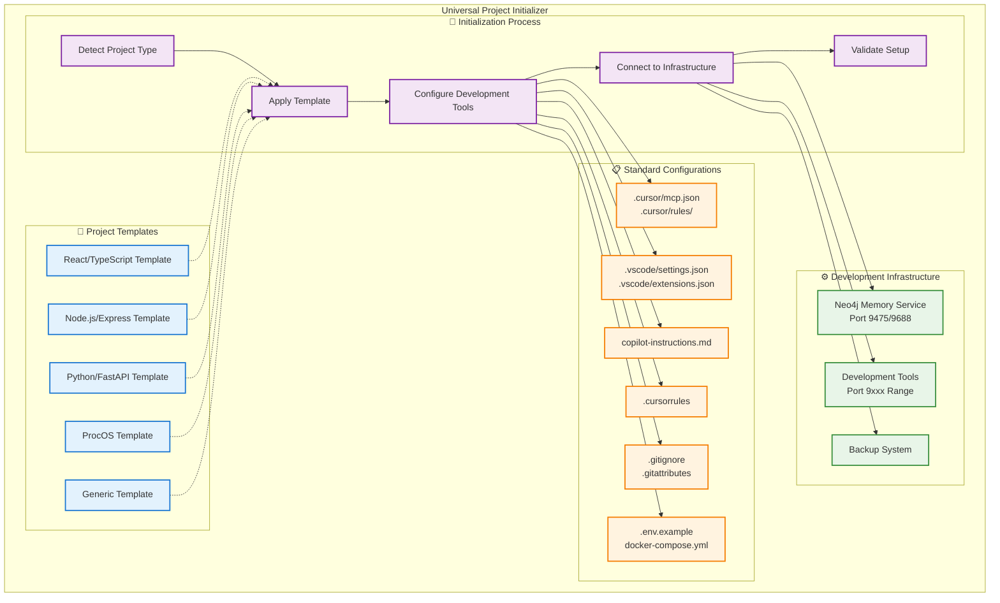
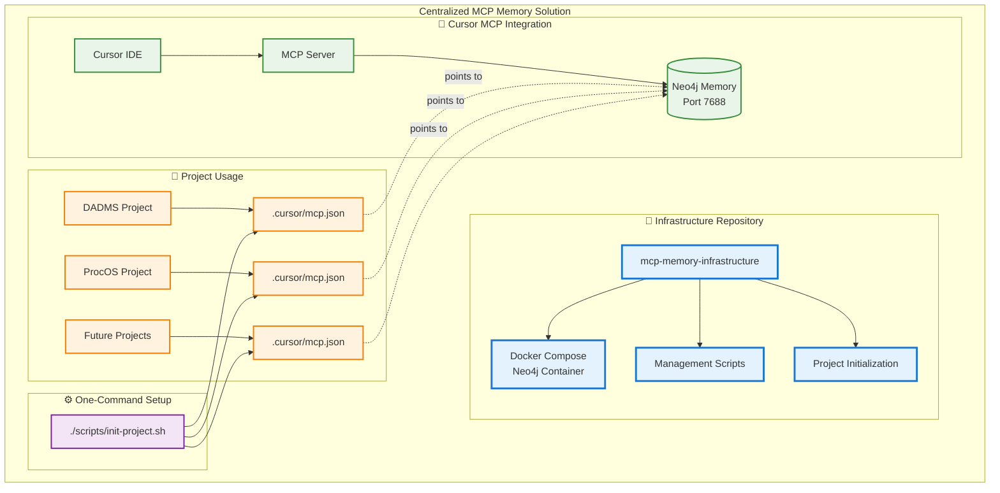
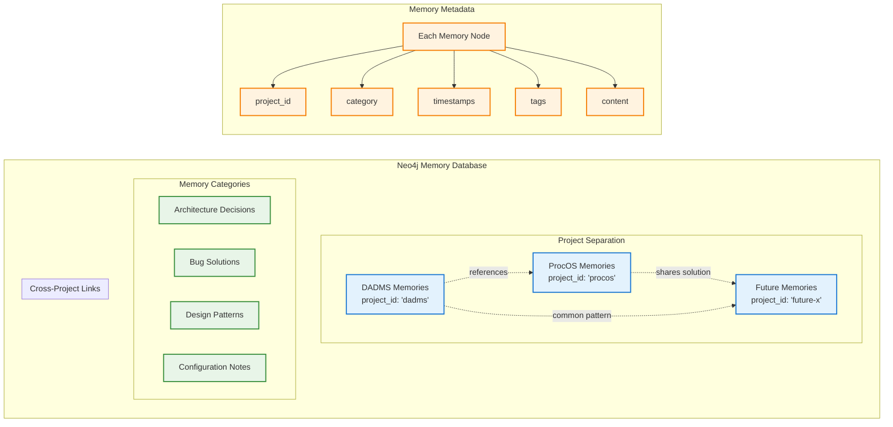
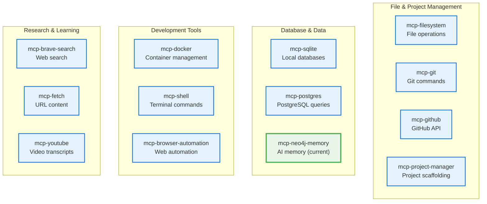

# Dev Project Initializer

**Universal project initialization toolkit with development infrastructure**

This repository provides a **comprehensive project initialization system** that sets up new development projects with standardized configurations, development tools, and infrastructure. Following best practices from frameworks like Create React App and Angular CLI, this toolkit ensures consistent development environments across all your projects.

## 🎯 **Why This Approach?**

**Best Practice Pattern**: Major frameworks use initialization toolkits:
- **Create React App** - React project scaffolding
- **Angular CLI** - Angular project initialization  
- **Rails new** - Ruby on Rails setup
- **Yeoman generators** - Web development scaffolding

**Our toolkit** extends this pattern for **any project type** with:
- ✅ **Standardized IDE configurations** (Cursor, VSCode)
- ✅ **Development infrastructure** (Memory, tools, backups)
- ✅ **Project templates** (React, Node.js, Python, ProcOS, etc.)
- ✅ **Port management** (Unusual ports to avoid conflicts)
- ✅ **Team consistency** (Same setup across all developers)

## 🎯 **What This Provides**

### **Centralized Memory**
- **Single Neo4j instance** serves all projects
- **Project-specific metadata** keeps memories organized
- **Cross-project knowledge** sharing and references
- **Unified backup/restore** system for all development context

### **Easy Project Integration**
- **One-command setup** for new projects
- **Automatic Cursor configuration** for MCP integration
- **Standardized memory patterns** across all projects
- **Cursor rules** for consistent memory usage

### **Robust Data Management**
- **Automated backups** with timestamp and compression
- **Easy restore** from any backup point
- **Health monitoring** and diagnostics
- **Production-ready** container configuration

## 🚀 **Quick Start**

### **1. Start the Memory Service**
```bash
cd /path/to/mcp-memory-infrastructure
docker-compose up -d
```

### **2. Initialize a Project**

#### **🚀 Enhanced Initialization (Recommended)**
```bash
# Enhanced initialization with DADMS-derived configurations
./scripts/init-project-enhanced.sh procos /home/user/procos
./scripts/init-project-enhanced.sh my-ai-project /path/to/my-project
```

**Enhanced features include:**
- **3 MCP Servers**: neo4j-memory, neo4j-cypher, huggingface-mcp
- **7 Advanced Rules**: Development standards, architecture, testing, code quality
- **Automatic Memory**: Intelligent storage during development
- **Adaptive Templates**: Project-specific configurations
- **Enterprise Standards**: DADMS-derived best practices

#### **📝 Basic Initialization**
```bash
# Basic initialization (memory only)
./scripts/init-project.sh my-project /path/to/my-project
```

### **3. Use in Cursor**
1. Restart Cursor to load the enhanced MCP configuration
2. Ask the AI to remember something about your project
3. Memories will be automatically stored with advanced rules active
4. Benefit from automatic code quality and architecture guidance

## 🏗️ **Architecture**

### **Universal Project Initializer System**



### **Port Management Strategy**

Development infrastructure uses **unusual ports** (9xxx range) to avoid conflicts with application ports (3000-8000):

| Service | Production Port | **Development Port** | Purpose |
|---------|-----------------|---------------------|---------|
| Neo4j Web UI | 7474 | **9475** | Memory database interface |
| Neo4j Bolt | 7687 | **9688** | MCP memory connection |
| Development Tools | Various | **9100-9999** | Isolated development services |

### **Legacy Memory Integration**



### **Memory Data Organization**



## 🎯 **Project Templates & Types**

The initialization system supports multiple project types with standardized configurations:

### **Available Templates**

| Template | Description | Includes |
|----------|-------------|----------|
| **React/TypeScript** | Modern React application | Vite, TypeScript, ESLint, Prettier |
| **Node.js/Express** | Backend API server | Express, TypeScript, Jest, Nodemon |
| **Python/FastAPI** | Python web API | FastAPI, Pydantic, pytest, uvicorn |
| **ProcOS** | Process-oriented system | Microkernel, BPMN, Camunda integration |
| **Generic** | Basic development setup | Standard IDE configs, memory integration |

### **Standard Configuration Files**

Every initialized project gets:
- **`.cursor/mcp.json`** - MCP server configuration
- **`.cursor/rules/`** - Project-specific Cursor rules  
- **`.vscode/settings.json`** - VSCode configuration
- **`.vscode/extensions.json`** - Recommended extensions
- **`copilot-instructions.md`** - AI pair programming guidelines
- **`.cursorrules`** - Memory usage and development guidelines
- **`.gitignore`** - Language/framework-specific ignores
- **`.env.example`** - Environment variable template
- **`docker-compose.yml`** - Development infrastructure (if applicable)

### **Customization**

Templates can be customized by:
1. **Modifying template files** in `templates/` directory
2. **Adding custom rules** in `.cursor/rules/`
3. **Project-specific overrides** during initialization

## 📋 **Repository Structure**

```
dev-project-init/
├── docker-compose.yml              # Development memory service
├── README.md                       # This file
├── 
├── scripts/                        # Management utilities
│   ├── init-project.sh            # Universal project initializer
│   ├── backup-memory.sh            # Create memory backups
│   ├── restore-memory.sh           # Restore from backups
│   └── check_memory.sh             # Health diagnostics
├── 
├── templates/                      # Project templates
│   ├── react-typescript/          # React + TypeScript template
│   ├── node-express/               # Node.js + Express template
│   ├── python-fastapi/             # Python + FastAPI template
│   ├── procos/                     # ProcOS system template
│   └── generic/                    # Basic development template
├── 
├── backups/                        # Backup storage
│   └── dev-memory/                 # Development memory backups
├── 
├── config/                         # Base configurations
│   ├── cursor/                     # Cursor IDE configurations
│   ├── vscode/                     # VSCode configurations
│   └── git/                        # Git configurations
└── docs/                           # Additional documentation
```

## 🔧 **Management Commands**

### **Service Management**
```bash
# Start memory service
docker-compose up -d

# Stop memory service  
docker-compose down

# View logs
docker-compose logs -f neo4j-memory

# Check service status
docker-compose ps
```

### **Project Setup**

The initialization script handles all configuration automatically:


**Usage Examples:**
```bash
# Initialize new project
./scripts/init-project.sh <project-name> <project-path>

# Setup ProcOS
./scripts/init-project.sh procos /home/user/procos

# Setup DADMS  
./scripts/init-project.sh dadms /home/user/dadms
```

### **Backup & Restore**
```bash
# Create backup
./scripts/backup-memory.sh

# List available backups
ls -la backups/mcp-memory/

# Restore latest backup
./scripts/restore-memory.sh latest

# Restore specific backup
./scripts/restore-memory.sh mcp-memory-backup-20240101_120000.cypher.gz
```

### **Health Monitoring**
```bash
# Check memory service health
./scripts/check_memory.sh

# Access Neo4j web interface
open http://localhost:7475
```

## 🔗 **Service Access**

| Service | URL | Purpose |
|---------|-----|---------|
| **Neo4j Web UI** | http://localhost:9475 | Visual database interface (unusual port) |
| **Bolt Connection** | neo4j://localhost:9688 | MCP protocol connection (unusual port) |
| **Authentication** | neo4j / devmemorypass | Database credentials |

**Note**: Using unusual ports (9xxx range) to avoid conflicts with application development ports (3000-8000).

## 🎓 **How Projects Use This**

### **Automatic Integration**
When you run `./scripts/init-project.sh`, it creates:

1. **`.cursor/settings.json`** - MCP server configuration
2. **`.cursorrules`** - Memory usage guidelines for the project
3. **Connection test** - Verifies the memory service is accessible

### **Memory Organization**
Each memory entry includes:
- **Project ID**: `dadms`, `procos`, `my-project`
- **Category**: `architecture`, `bug`, `decision`, `pattern`
- **Content**: The actual knowledge/solution
- **Relationships**: Links to related memories
- **Timestamps**: Creation and update times

### **Cross-Project Benefits**
- **Shared Solutions**: Bug fixes discovered in one project help others
- **Architecture Patterns**: Design decisions can be referenced across projects
- **Team Knowledge**: Institutional knowledge persists across project boundaries
- **Context Preservation**: Development history maintains continuity

## 🔄 **Migration from Project-Specific Memory**

### **From DADMS Memory**
If you currently have DADMS-specific memory:

1. **Create backup** of existing DADMS memory
2. **Start centralized service** with this infrastructure
3. **Restore DADMS backup** to centralized service
4. **Update DADMS** MCP configuration to point to centralized service

### **Backup Migration Commands**
```bash
# From DADMS project directory
cd /path/to/dadms
./scripts/backup-memory.sh

# Copy backup to centralized infrastructure
cp backups/mcp-memory/mcp-memory-backup-*.cypher.gz \
   /path/to/mcp-memory-infrastructure/backups/mcp-memory/

# Start centralized service
cd /path/to/mcp-memory-infrastructure
docker-compose up -d

# Restore migrated backup
./scripts/restore-memory.sh mcp-memory-backup-*.cypher.gz
```

## 📊 **Backup Strategy**

### **Automatic Backup Management**
- **Timestamped backups**: Each backup includes date/time
- **Compressed storage**: All backups are gzipped to save space
- **Retention policy**: Automatically keeps last 7 backups
- **Easy restore**: Simple commands to restore any backup point

### **Backup File Format**
```
backups/mcp-memory/
├── mcp-memory-backup-20240101_120000.cypher.gz
├── mcp-memory-backup-20240101_180000.cypher.gz
└── mcp-memory-backup-20240102_090000.cypher.gz
```

## 🛡️ **Security & Production**

### **Development Setup**
- **Default credentials**: `neo4j/memorypassword` (change for production)
- **Local network**: Service bound to localhost only
- **No external access**: Firewall-friendly configuration

### **Production Considerations**
- **Change passwords**: Update `NEO4J_AUTH` in docker-compose.yml
- **Persistent volumes**: Data survives container restarts
- **Health checks**: Automatic service monitoring
- **Resource limits**: Uncomment memory settings for production loads

## 🔧 **Troubleshooting**

### **Common Issues**

#### **Service Won't Start**
```bash
# Check if ports are available
lsof -i :7475 -i :7688

# Check Docker is running
docker ps

# View service logs
docker-compose logs neo4j-memory
```

#### **Connection Failed**
```bash
# Test network connectivity
nc -z localhost 7688

# Check MCP configuration
cat .cursor/settings.json

# Restart Cursor to reload MCP config
```

#### **Backup/Restore Issues**
```bash
# Verify container is running
docker ps | grep mcp-neo4j-memory

# Check container logs
docker logs mcp-neo4j-memory

# Test APOC is available
docker exec mcp-neo4j-memory cypher-shell -u neo4j -p memorypassword \
  "RETURN apoc.version() AS version"
```

## 🤝 **Team Usage**

### **Multi-Developer Setup**
- **Shared service**: One memory service per team/environment
- **Project isolation**: Memories tagged by project for organization
- **Collaborative knowledge**: Team members share discovered solutions
- **Consistent setup**: Same initialization process for all team members

### **Development Workflow**
1. **Start memory service** (once per development session)
2. **Work on any project** (DADMS, ProcOS, etc.)
3. **Memories automatically stored** in centralized service
4. **Knowledge shared** across all projects and team members
5. **Regular backups** preserve all development context

---

## 🎯 **Next Steps**

1. **Start the service**: `docker-compose up -d`
2. **Initialize your projects**: `./scripts/init-project.sh <project> <path>`
3. **Test memory creation**: Ask Cursor AI to remember something
4. **Setup backups**: Schedule regular `./scripts/backup-memory.sh` runs
5. **Share with team**: Point team members to this repository

**Your centralized development memory service is ready! All projects can now share knowledge and development context seamlessly.**

---

## 🚀 **Future Enhancements**

*Following industry best practices from major frameworks and development tools*

### **🧠 Additional MCP Servers**

**Understanding MCP**: Model Context Protocol servers are specialized tools that provide AI assistants with enhanced capabilities through standardized protocols. Unlike regular infrastructure services, MCP servers extend AI functionality with context-aware operations.

**Current Setup**: We use `mcp-neo4j-memory` for development memory management.

**Reference**: [Awesome MCP Servers](https://github.com/punkpeye/awesome-mcp-servers) - Comprehensive list of production-ready MCP servers.

#### **Development Workflow MCP Servers**


| Category | MCP Server | Purpose | Use Cases |
|----------|------------|---------|-----------|
| **File Management** | `mcp-filesystem` | File system operations | Read/write files, directory management |
| **Version Control** | `mcp-git` | Git repository operations | Commits, branches, repository analysis |
| **GitHub Integration** | `mcp-github` | GitHub API interactions | Issues, PRs, repository management |
| **Database Operations** | `mcp-sqlite` | SQLite database queries | Local database development and testing |
| **Container Management** | `mcp-docker` | Docker operations via MCP | Container lifecycle, image management |
| **Web Research** | `mcp-brave-search` | Web search capabilities | Research, documentation lookup |
| **Content Fetching** | `mcp-fetch` | URL content retrieval | API documentation, web scraping |
| **Development Memory** | `mcp-neo4j-memory` | AI memory management | **Currently implemented** |

#### **Communication & Collaboration MCP Servers**

| Category | MCP Server | Purpose | Use Cases |
|----------|------------|---------|-----------|
| **Team Communication** | `mcp-slack` | Slack API integration | Send messages, read channels, team notifications |
| **Project Management** | `mcp-linear` | Linear project management | Issue tracking, project planning, sprint management |
| **Documentation** | `mcp-confluence` | Confluence integration | Read/write documentation, knowledge management |
| **Task Management** | `mcp-asana` | Asana task management | Task creation, project tracking, team coordination |
| **Code Reviews** | `mcp-github` | GitHub code reviews | PR management, code review automation |

#### **Specialized Development MCP Servers**

| Category | MCP Server | Purpose | Use Cases |
|----------|------------|---------|-----------|
| **AI Integration** | `mcp-openai` | OpenAI API access | Chat with AI models, embeddings, completions |
| **Data Analysis** | `mcp-pandas` | Data manipulation | DataFrame operations, data analysis, CSV processing |
| **Testing** | `mcp-playwright` | Browser automation | E2E testing, web scraping, UI automation |
| **Security** | `mcp-1password` | Password management | Secure credential access, secret management |
| **Monitoring** | `mcp-prometheus` | Metrics and monitoring | System metrics, performance monitoring |
| **Calendar** | `mcp-google-calendar` | Calendar integration | Schedule management, meeting coordination |

### **🎯 Project-Specific Enhancements**

#### **ProcOS Development Suite**

**Custom MCP Servers for ProcOS** (Process-Oriented Operating System):

| MCP Server | Purpose | ProcOS Integration |
|------------|---------|-------------------|
| **mcp-bpmn-analyzer** | BPMN process analysis | Validate process models, detect patterns |
| **mcp-camunda-client** | Camunda engine integration | Deploy processes, monitor instances |
| **mcp-process-simulator** | Process simulation | Test workflows before deployment |
| **mcp-workflow-optimizer** | Performance analysis | Identify bottlenecks, suggest improvements |

**Note**: These would be custom-built MCP servers specifically for ProcOS development workflow.

#### **Framework-Specific MCP Server Usage**

**React/TypeScript Projects**:
- `mcp-filesystem` - Component file management
- `mcp-git` - Version control for React components
- `mcp-browser-automation` - Component testing automation
- `mcp-fetch` - API integration for React apps

**Node.js/Express Projects**:
- `mcp-sqlite` - Database operations for Node.js
- `mcp-docker` - Container management for Node services
- `mcp-shell` - Build script automation
- `mcp-github` - Repository management for Node projects

### **🔧 Implementation Roadmap**

#### **Phase 1: Essential Development MCP Servers** *(Q1)*
- **`mcp-filesystem`** - File system operations for project management
- **`mcp-git`** - Version control integration
- **`mcp-sqlite`** - Local database development and testing

#### **Phase 2: Collaboration & Integration** *(Q2)*
- **`mcp-github`** - Repository management and code reviews  
- **`mcp-slack`** - Team communication integration
- **`mcp-docker`** - Container management for development

#### **Phase 3: Advanced Development Tools** *(Q3)*
- **`mcp-browser-automation`** - Web testing and automation
- **`mcp-fetch`** - API integration and web scraping
- **`mcp-shell`** - Advanced terminal operations

#### **Phase 4: Specialized & Custom** *(Q4)*
- **ProcOS-specific MCP servers** - Custom BPMN and process tools
- **`mcp-openai`** - AI integration for enhanced development
- **Custom project-specific MCP servers**

### **💡 MCP Configuration Examples**

#### **Current Setup** - Single MCP Server
```json
{
    "$schema": "https://json.schemastore.org/mcp.json",
    "description": "Development Memory Configuration",
    "mcpServers": {
        "neo4j-memory": {
            "command": "uvx",
            "args": [
                "mcp-neo4j-memory",
                "--db-url", "neo4j://localhost:9688",
                "--username", "neo4j",
                "--password", "devmemorypass"
            ]
        }
    }
}
```

#### **Future Setup** - Multiple MCP Servers
```json
{
    "$schema": "https://json.schemastore.org/mcp.json",
    "description": "Enhanced Development MCP Configuration",
    "mcpServers": {
        "neo4j-memory": {
            "command": "uvx",
            "args": [
                "mcp-neo4j-memory",
                "--db-url", "neo4j://localhost:9688",
                "--username", "neo4j",
                "--password", "devmemorypass"
            ]
        },
        "filesystem": {
            "command": "uvx",
            "args": ["mcp-filesystem", "--read-write"]
        },
        "git": {
            "command": "uvx", 
            "args": ["mcp-git"]
        },
        "github": {
            "command": "uvx",
            "args": ["mcp-github", "--auth-token", "${GITHUB_TOKEN}"]
        },
        "sqlite": {
            "command": "uvx",
            "args": ["mcp-sqlite", "--db-path", "./dev.db"]
        },
        "fetch": {
            "command": "uvx",
            "args": ["mcp-fetch"]
        }
    }
}
```

### **🌟 Community & Resources**

#### **MCP Server Ecosystem**
- **[Awesome MCP Servers](https://github.com/punkpeye/awesome-mcp-servers)** - Comprehensive MCP server directory
- **[glama.ai/mcp/servers](https://glama.ai/mcp/servers)** - Browse and discover MCP servers
- **[MCP Documentation](https://modelcontextprotocol.io/)** - Official Model Context Protocol docs
- **[r/mcp Reddit](https://www.reddit.com/r/mcp/)** - Community discussions and support

#### **Contributing to MCP Ecosystem**
- **Build custom MCP servers** for specialized workflows
- **Share project templates** that integrate useful MCP servers
- **Document MCP server configurations** for different development scenarios
- **Create tutorials** for MCP server setup and usage

#### **Development Philosophy**
This Universal Project Initializer bridges the gap between AI capabilities and development workflows by:
- **Standardizing MCP server configurations** across projects
- **Providing templates** that include proven MCP server combinations
- **Enabling rapid onboarding** with pre-configured AI development tools
- **Maintaining consistency** across development environments

---

**The future of development is AI-enhanced workflows. This toolkit provides the foundation for integrating Model Context Protocol servers into every project, making AI assistance a natural part of the development process.**