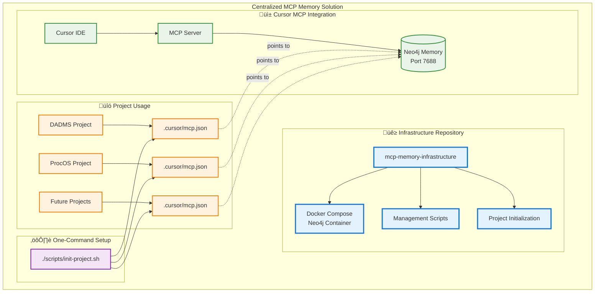

# Dev Project Initializer

**Universal project initialization toolkit with development infrastructure**

This repository provides a **comprehensive project initialization system** that sets up new development projects with standardized configurations, development tools, and infrastructure. Following best practices from frameworks like Create React App and Angular CLI, this toolkit ensures consistent development environments across all your projects.

## 🎯 **Why This Approach?**

**Best Practice Pattern**: Major frameworks use initialization toolkits:
- **Create React App** - React project scaffolding
- **Angular CLI** - Angular project initialization  
- **Rails new** - Ruby on Rails setup
- **Yeoman generators** - Web development scaffolding

**Our toolkit** extends this pattern for **any project type** with:
- ✅ **Standardized IDE configurations** (Cursor, VSCode)
- ✅ **Development infrastructure** (Memory, tools, backups)
- ✅ **Project templates** (React, Node.js, Python, ProcOS, etc.)
- ✅ **Port management** (Unusual ports to avoid conflicts)
- ✅ **Team consistency** (Same setup across all developers)

## 🎯 **What This Provides**

### **Centralized Memory**
- **Single Neo4j instance** serves all projects
- **Project-specific metadata** keeps memories organized
- **Cross-project knowledge** sharing and references
- **Unified backup/restore** system for all development context

### **Easy Project Integration**
- **One-command setup** for new projects
- **Automatic Cursor configuration** for MCP integration
- **Standardized memory patterns** across all projects
- **Cursor rules** for consistent memory usage

### **Robust Data Management**
- **Automated backups** with timestamp and compression
- **Easy restore** from any backup point
- **Health monitoring** and diagnostics
- **Production-ready** container configuration

## 🚀 **Quick Start**

### **1. Start the Memory Service**
```bash
cd /path/to/mcp-memory-infrastructure
docker-compose up -d
```

### **2. Initialize a Project**
```bash
# For ProcOS project
./scripts/init-project.sh procos /home/user/procos

# For DADMS project  
./scripts/init-project.sh dadms /home/user/dadms

# For any new project
./scripts/init-project.sh my-project /path/to/my-project
```

### **3. Use in Cursor**
1. Restart Cursor to load the new MCP configuration
2. Ask the AI to remember something about your project
3. Memories will be automatically stored in the centralized service

## 🏗️ **Architecture**

### **Universal Project Initializer System**

```mermaid
graph TB
    subgraph "Universal Project Initializer"
        subgraph "🎯 Project Templates"
            REACT[React/TypeScript Template]
            NODE[Node.js/Express Template]
            PYTHON[Python/FastAPI Template]
            PROCOS[ProcOS Template]
            GENERIC[Generic Template]
        end
        
        subgraph "⚙️ Development Infrastructure"
            NEO[Neo4j Memory Service<br/>Port 9475/9688]
            TOOLS[Development Tools<br/>Port 9xxx Range]
            BACKUP[Backup System]
        end
        
        subgraph "📋 Standard Configurations"
            CURSOR[.cursor/mcp.json<br/>.cursor/rules/]
            VSCODE[.vscode/settings.json<br/>.vscode/extensions.json]
            COPILOT[copilot-instructions.md]
            RULES[.cursorrules]
            GIT[.gitignore<br/>.gitattributes]
            ENV[.env.example<br/>docker-compose.yml]
        end
        
        subgraph "🚀 Initialization Process"
            DETECT[Detect Project Type]
            TEMPLATE[Apply Template]
            CONFIG[Configure Development Tools]
            CONNECT[Connect to Infrastructure]
            TEST[Validate Setup]
        end
        
        DETECT --> TEMPLATE
        TEMPLATE --> CONFIG
        CONFIG --> CONNECT
        CONNECT --> TEST
        
        REACT -.-> TEMPLATE
        NODE -.-> TEMPLATE
        PYTHON -.-> TEMPLATE
        PROCOS -.-> TEMPLATE
        GENERIC -.-> TEMPLATE
        
        CONFIG --> CURSOR
        CONFIG --> VSCODE
        CONFIG --> COPILOT
        CONFIG --> RULES
        CONFIG --> GIT
        CONFIG --> ENV
        
        CONNECT --> NEO
        CONNECT --> TOOLS
        CONNECT --> BACKUP
    end
    
    classDef template fill:#e3f2fd,stroke:#1976d2,stroke-width:2px
    classDef infra fill:#e8f5e8,stroke:#388e3c,stroke-width:2px
    classDef config fill:#fff3e0,stroke:#f57c00,stroke-width:2px
    classDef process fill:#f3e5f5,stroke:#7b1fa2,stroke-width:2px
    
    class REACT,NODE,PYTHON,PROCOS,GENERIC template
    class NEO,TOOLS,BACKUP infra
    class CURSOR,VSCODE,COPILOT,RULES,GIT,ENV config
    class DETECT,TEMPLATE,CONFIG,CONNECT,TEST process
```



### **Port Management Strategy**

Development infrastructure uses **unusual ports** (9xxx range) to avoid conflicts with application ports (3000-8000):

| Service | Production Port | **Development Port** | Purpose |
|---------|-----------------|---------------------|---------|
| Neo4j Web UI | 7474 | **9475** | Memory database interface |
| Neo4j Bolt | 7687 | **9688** | MCP memory connection |
| Development Tools | Various | **9100-9999** | Isolated development services |

### **Legacy Memory Integration**



### **Memory Data Organization**


## 🎯 **Project Templates & Types**

The initialization system supports multiple project types with standardized configurations:

### **Available Templates**

| Template | Description | Includes |
|----------|-------------|----------|
| **React/TypeScript** | Modern React application | Vite, TypeScript, ESLint, Prettier |
| **Node.js/Express** | Backend API server | Express, TypeScript, Jest, Nodemon |
| **Python/FastAPI** | Python web API | FastAPI, Pydantic, pytest, uvicorn |
| **ProcOS** | Process-oriented system | Microkernel, BPMN, Camunda integration |
| **Generic** | Basic development setup | Standard IDE configs, memory integration |

### **Standard Configuration Files**

Every initialized project gets:
- **`.cursor/mcp.json`** - MCP server configuration
- **`.cursor/rules/`** - Project-specific Cursor rules  
- **`.vscode/settings.json`** - VSCode configuration
- **`.vscode/extensions.json`** - Recommended extensions
- **`copilot-instructions.md`** - AI pair programming guidelines
- **`.cursorrules`** - Memory usage and development guidelines
- **`.gitignore`** - Language/framework-specific ignores
- **`.env.example`** - Environment variable template
- **`docker-compose.yml`** - Development infrastructure (if applicable)

### **Customization**

Templates can be customized by:
1. **Modifying template files** in `templates/` directory
2. **Adding custom rules** in `.cursor/rules/`
3. **Project-specific overrides** during initialization

## 📋 **Repository Structure**

```
dev-project-init/
├── docker-compose.yml              # Development memory service
├── README.md                       # This file
├── 
├── scripts/                        # Management utilities
│   ├── init-project.sh            # Universal project initializer
│   ├── backup-memory.sh            # Create memory backups
│   ├── restore-memory.sh           # Restore from backups
│   └── check_memory.sh             # Health diagnostics
├── 
├── templates/                      # Project templates
│   ├── react-typescript/          # React + TypeScript template
│   ├── node-express/               # Node.js + Express template
│   ├── python-fastapi/             # Python + FastAPI template
│   ├── procos/                     # ProcOS system template
│   └── generic/                    # Basic development template
├── 
├── backups/                        # Backup storage
│   └── dev-memory/                 # Development memory backups
├── 
├── config/                         # Base configurations
│   ├── cursor/                     # Cursor IDE configurations
│   ├── vscode/                     # VSCode configurations
│   └── git/                        # Git configurations
└── docs/                           # Additional documentation
```

## 🔧 **Management Commands**

### **Service Management**
```bash
# Start memory service
docker-compose up -d

# Stop memory service  
docker-compose down

# View logs
docker-compose logs -f neo4j-memory

# Check service status
docker-compose ps
```

### **Project Setup**

The initialization script handles all configuration automatically:


**Usage Examples:**
```bash
# Initialize new project
./scripts/init-project.sh <project-name> <project-path>

# Setup ProcOS
./scripts/init-project.sh procos /home/user/procos

# Setup DADMS  
./scripts/init-project.sh dadms /home/user/dadms
```

### **Backup & Restore**
```bash
# Create backup
./scripts/backup-memory.sh

# List available backups
ls -la backups/mcp-memory/

# Restore latest backup
./scripts/restore-memory.sh latest

# Restore specific backup
./scripts/restore-memory.sh mcp-memory-backup-20240101_120000.cypher.gz
```

### **Health Monitoring**
```bash
# Check memory service health
./scripts/check_memory.sh

# Access Neo4j web interface
open http://localhost:7475
```

## 🔗 **Service Access**

| Service | URL | Purpose |
|---------|-----|---------|
| **Neo4j Web UI** | http://localhost:9475 | Visual database interface (unusual port) |
| **Bolt Connection** | neo4j://localhost:9688 | MCP protocol connection (unusual port) |
| **Authentication** | neo4j / devmemorypass | Database credentials |

**Note**: Using unusual ports (9xxx range) to avoid conflicts with application development ports (3000-8000).

## 🎓 **How Projects Use This**

### **Automatic Integration**
When you run `./scripts/init-project.sh`, it creates:

1. **`.cursor/settings.json`** - MCP server configuration
2. **`.cursorrules`** - Memory usage guidelines for the project
3. **Connection test** - Verifies the memory service is accessible

### **Memory Organization**
Each memory entry includes:
- **Project ID**: `dadms`, `procos`, `my-project`
- **Category**: `architecture`, `bug`, `decision`, `pattern`
- **Content**: The actual knowledge/solution
- **Relationships**: Links to related memories
- **Timestamps**: Creation and update times

### **Cross-Project Benefits**
- **Shared Solutions**: Bug fixes discovered in one project help others
- **Architecture Patterns**: Design decisions can be referenced across projects
- **Team Knowledge**: Institutional knowledge persists across project boundaries
- **Context Preservation**: Development history maintains continuity

## 🔄 **Migration from Project-Specific Memory**

### **From DADMS Memory**
If you currently have DADMS-specific memory:

1. **Create backup** of existing DADMS memory
2. **Start centralized service** with this infrastructure
3. **Restore DADMS backup** to centralized service
4. **Update DADMS** MCP configuration to point to centralized service

### **Backup Migration Commands**
```bash
# From DADMS project directory
cd /path/to/dadms
./scripts/backup-memory.sh

# Copy backup to centralized infrastructure
cp backups/mcp-memory/mcp-memory-backup-*.cypher.gz \
   /path/to/mcp-memory-infrastructure/backups/mcp-memory/

# Start centralized service
cd /path/to/mcp-memory-infrastructure
docker-compose up -d

# Restore migrated backup
./scripts/restore-memory.sh mcp-memory-backup-*.cypher.gz
```

## 📊 **Backup Strategy**

### **Automatic Backup Management**
- **Timestamped backups**: Each backup includes date/time
- **Compressed storage**: All backups are gzipped to save space
- **Retention policy**: Automatically keeps last 7 backups
- **Easy restore**: Simple commands to restore any backup point

### **Backup File Format**
```
backups/mcp-memory/
├── mcp-memory-backup-20240101_120000.cypher.gz
├── mcp-memory-backup-20240101_180000.cypher.gz
└── mcp-memory-backup-20240102_090000.cypher.gz
```

## 🛡️ **Security & Production**

### **Development Setup**
- **Default credentials**: `neo4j/memorypassword` (change for production)
- **Local network**: Service bound to localhost only
- **No external access**: Firewall-friendly configuration

### **Production Considerations**
- **Change passwords**: Update `NEO4J_AUTH` in docker-compose.yml
- **Persistent volumes**: Data survives container restarts
- **Health checks**: Automatic service monitoring
- **Resource limits**: Uncomment memory settings for production loads

## 🔧 **Troubleshooting**

### **Common Issues**

#### **Service Won't Start**
```bash
# Check if ports are available
lsof -i :7475 -i :7688

# Check Docker is running
docker ps

# View service logs
docker-compose logs neo4j-memory
```

#### **Connection Failed**
```bash
# Test network connectivity
nc -z localhost 7688

# Check MCP configuration
cat .cursor/settings.json

# Restart Cursor to reload MCP config
```

#### **Backup/Restore Issues**
```bash
# Verify container is running
docker ps | grep mcp-neo4j-memory

# Check container logs
docker logs mcp-neo4j-memory

# Test APOC is available
docker exec mcp-neo4j-memory cypher-shell -u neo4j -p memorypassword \
  "RETURN apoc.version() AS version"
```

## 🤝 **Team Usage**

### **Multi-Developer Setup**
- **Shared service**: One memory service per team/environment
- **Project isolation**: Memories tagged by project for organization
- **Collaborative knowledge**: Team members share discovered solutions
- **Consistent setup**: Same initialization process for all team members

### **Development Workflow**
1. **Start memory service** (once per development session)
2. **Work on any project** (DADMS, ProcOS, etc.)
3. **Memories automatically stored** in centralized service
4. **Knowledge shared** across all projects and team members
5. **Regular backups** preserve all development context

---

## 🎯 **Next Steps**

1. **Start the service**: `docker-compose up -d`
2. **Initialize your projects**: `./scripts/init-project.sh <project> <path>`
3. **Test memory creation**: Ask Cursor AI to remember something
4. **Setup backups**: Schedule regular `./scripts/backup-memory.sh` runs
5. **Share with team**: Point team members to this repository

**Your centralized development memory service is ready! All projects can now share knowledge and development context seamlessly.**